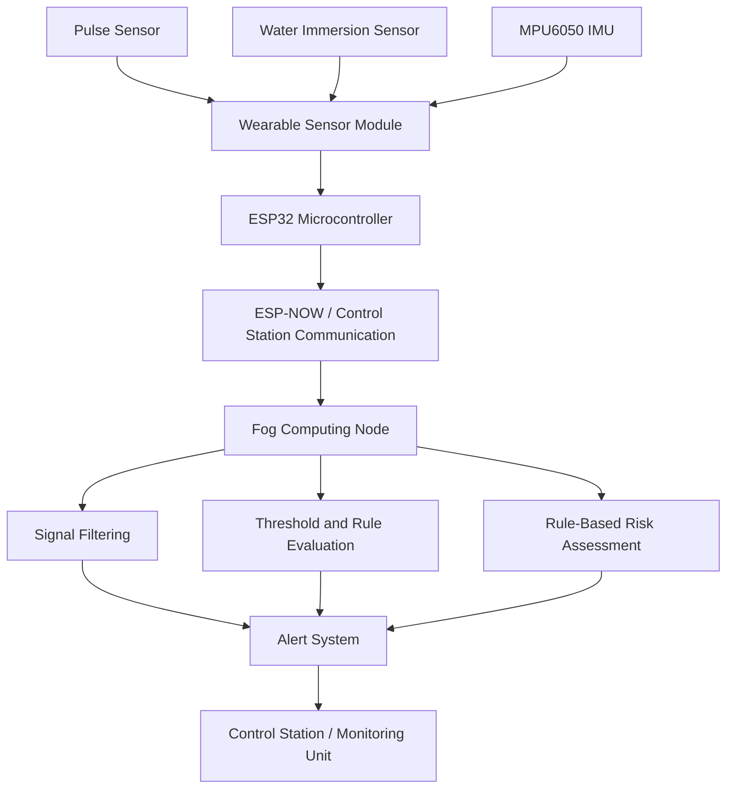
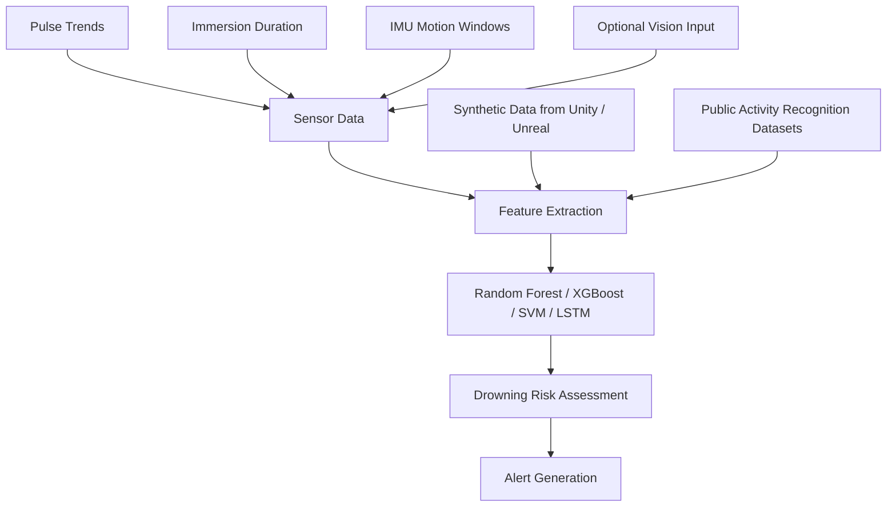

# Drowning Detection and Rescue System


> Work in Progress: a third-year academic project exploring wearable, fog-assisted drowning risk detection using ESP32, multi-sensor fusion, and future AI-based risk assessment.

## Overview

The Drowning Detection and Rescue System is a wearable IoT prototype designed to detect possible drowning-risk events in aquatic environments. The project combines physiological sensing, water immersion detection, motion analysis, and fog computing so that safety-critical decisions can be evaluated near the swimmer instead of depending only on remote cloud services.

The current implementation uses threshold-based and rule-based detection with ESP32-based communication and fog processing. Future research directions include machine learning, synthetic data generation, infrastructure-assisted networking, and shoreline-scale deployment.

This repository contains only publicly shareable project material. Personal information, signatures, registration numbers, and copied report literature sections are intentionally excluded.

## Motivation

Drowning incidents can happen quickly, silently, and with limited visible struggle. Manual supervision is essential, but technology can support lifeguards and monitoring teams by continuously tracking risk indicators from swimmers.

This project aims to move beyond a basic "sensor plus buzzer" prototype by combining the following implemented elements:

- ESP32-based wearable sensing.
- Multi-sensor fusion from physiological, immersion, and motion data.
- Fog computing for low-latency local processing.
- Event-triggered alert generation.
- ESP-NOW peer-to-peer rescue communication.
- Communication with a control station.

## Features

- Wearable sensor architecture centered on ESP32.
- Pulse sensor support for physiological signal monitoring.
- Water immersion sensor support for submersion detection.
- MPU6050 IMU support for acceleration, motion, and orientation analysis.
- Threshold-based and rule-based drowning-risk detection.
- ESP-NOW peer-to-peer rescue communication.
- Communication with a control station.
- Fog computing layer for faster local decision making.
- Event-triggered alert system for monitoring personnel.

## Architecture



## Hardware Components

| Component | Role |
| --- | --- |
| ESP32 | Main microcontroller for sensor interfacing and wireless communication. |
| Pulse sensor | Monitors physiological signal changes that may indicate distress. |
| Water immersion sensor | Detects submersion and supports immersion-duration tracking. |
| MPU6050 IMU | Captures motion, acceleration, and orientation changes. |
| Wearable enclosure | Future housing for holding the sensing unit in a swimmer-wearable form factor. |
| Fog node | Performs local event evaluation before alert generation. |

## Current Detection Methodology

The current project does not claim a completed machine learning model or achieved ML accuracy. Detection is based on explainable threshold and rule evaluation because realistic drowning datasets and safe drowning-behavior simulation were not available during implementation.

Current risk indicators include:

- Abnormal physiological readings from the pulse sensor.
- Prolonged immersion detected by the water sensor.
- Unusual motion, sudden orientation change, or inactivity from the MPU6050.
- Combined rule checks at the fog layer.
- Alert generation when multiple risk conditions are satisfied.

Example decision flow:

```text
Sensor Readings
  -> Validate and filter values
  -> Check immersion duration
  -> Check physiological abnormality
  -> Check motion/orientation pattern
  -> Combine risk indicators
  -> Trigger alert if risk condition is met
```

This design is suitable for academic prototyping and architecture validation. It is not a certified life-saving system and should not be deployed as the sole safety mechanism in real aquatic environments.

## Fog Computing Layer

The fog computing layer is responsible for local, low-latency processing. Instead of sending every reading directly to the cloud, the ESP32 wearable can transmit sensor data to a nearby fog node that performs event evaluation close to the aquatic zone.

Fog-layer responsibilities:

- Receive real-time readings from wearable devices.
- Filter noisy sensor values.
- Evaluate threshold and rule-based risk conditions.
- Generate alerts with minimal delay.
- Communicate event information toward a control station.

## Alert System

The alert system is event-triggered. When the fog node identifies a possible drowning-risk event, it can notify monitoring personnel through a dashboard, mobile notification, buzzer, or emergency-response interface.

```text
Risk Event Detected
  -> Fog Node Confirms Rule Match
  -> Alert Message Generated
  -> Monitoring Team Notified
  -> Rescue Response Initiated
```

## Research Directions

The following sections describe possible future work. They are not implemented features in the current repository.

### Future AI Extension

Future work may extend the current threshold-based method into an AI-assisted drowning-risk classifier. The goal is not to replace human supervision, but to improve context-aware risk scoring using multiple sensor streams.



Future model candidates:

- Random Forest for interpretable feature-based classification.
- XGBoost for structured sensor-feature learning.
- Support Vector Machine for smaller feature-engineered datasets.
- LSTM for time-series sensor windows.
- CNN-based vision models for future camera-assisted detection, where privacy and deployment conditions allow.

Potential input features:

- Heart-rate trends and sudden physiological deviations.
- Immersion duration and repeated submersion events.
- Acceleration magnitude and variance.
- Orientation changes and inactivity windows.
- Motion-window statistics over time.

Because real drowning datasets are difficult to collect ethically and safely, future work may use synthetic data generated through Unity or Unreal Engine simulations. Public activity recognition datasets may also be useful for pretraining, benchmarking, or non-drowning motion comparison.

No ML accuracy, completed deep learning implementation, or validated rescue performance is claimed in the current repository.

### Future Networking Extension

For larger aquatic environments, a single wearable-to-fog connection may not be enough. Future work may investigate infrastructure-assisted communication, relay concepts, and coverage-aware networking.

```text
Wearable Nodes
  -> Possible Peer Communication
  -> Possible Infrastructure Support
  -> Fog Node
  -> Control Station Dashboard
```

Possible research goals:

- Wider monitoring coverage.
- Better communication reliability in crowded zones.
- Conceptual relay support between wearable nodes and edge gateways.
- Scalable alert forwarding to fog and dashboard layers.

### Future Shoreline Deployment

The long-term vision is a shoreline-scale monitoring network for pools, beaches, lakes, and training facilities.

A proposed future deployment architecture may include:

- Multiple swimmer wearables.
- Peer or infrastructure-assisted communication between nodes.
- Possible edge gateways positioned around the aquatic area.
- Fog nodes for local risk analysis and alert prioritization.
- Possible MQTT-based event transmission.
- Dashboard for lifeguards and monitoring teams.
- Optional cloud services for logs, analytics, and maintenance.

## Current Status

- Status: Work in Progress.
- Implemented direction: wearable sensor architecture and threshold/rule-based risk detection.
- Hardware focus: ESP32 interfacing with pulse, water immersion, and MPU6050 sensors.
- Software focus: sensor-data flow, ESP-NOW communication, control-station communication, fog processing, and event-triggered alerts.
- Future direction: machine learning, synthetic data, mesh networking, and shoreline-scale deployment.

## Team Contributions

This public repository describes contributions in generalized form:

- Hardware architecture and wearable module design.
- Sensor selection and interfacing strategy.
- ESP32-based data collection planning.
- Fog computing and alert-system design.
- Documentation, system modeling, and future extension planning.

## Repository Structure

```text
Drowning-Detection-and-Rescue-System/
  docs/
  diagrams/
  hardware/
  software/
  images/
  future-work/
  README.md
  LICENSE
```

## License

This project is released under the MIT License. See [LICENSE](LICENSE) for details.

## Disclaimer

This repository is an academic work-in-progress and is not a certified life-saving product. It must not be used as the sole safety mechanism in real aquatic environments.
