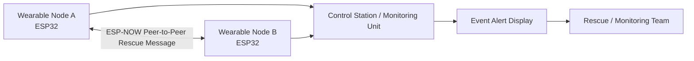

# Current ESP-NOW Communication Architecture

Status: Implemented diagram.

This diagram shows the current ESP32 and ESP-NOW based rescue communication concept, including communication toward a control station.

Note: This diagram does not claim implemented infrastructure nodes, dynamic relay selection, distributed storage, or shoreline-scale routing.
