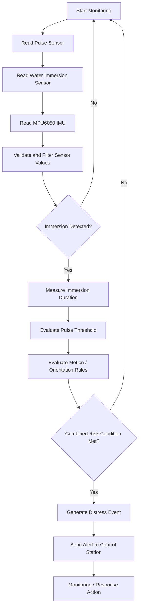

# Event-Triggered Drowning Detection Workflow

Status: Implemented diagram.

This flowchart describes the current rule-based detection workflow. The system evaluates sensor readings using thresholds and triggers alerts only when configured risk conditions are satisfied.

Note: This workflow does not use implemented machine learning.
