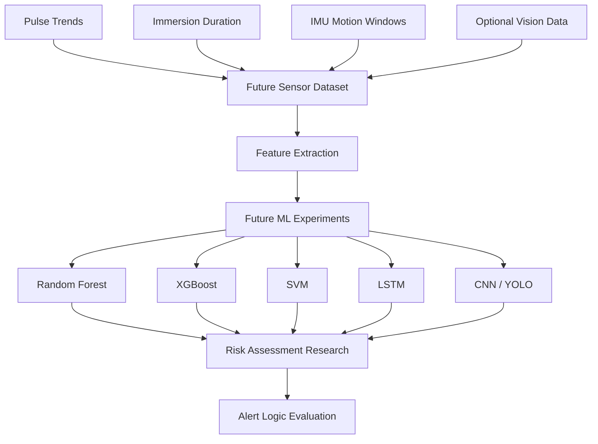

# Future AI-Enhanced Architecture

Status: Future work diagram.

This diagram shows a possible future AI-assisted extension. It is not implemented in the current repository.

Future work may investigate synthetic data generated using Unity or Unreal Engine simulations and public activity recognition datasets. No implemented AI model or achieved metric is claimed.
