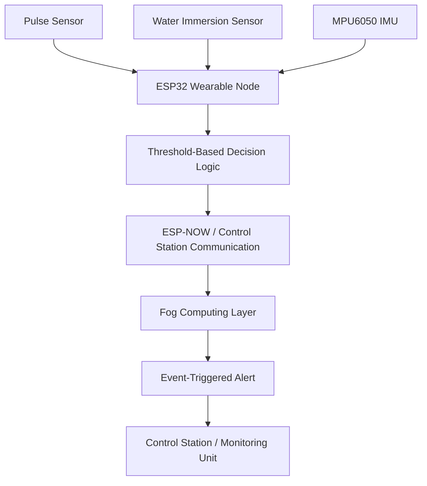

# Overall System Architecture

Status: Implemented diagram.

This diagram shows the current high-level system architecture: wearable sensing, ESP32 processing, ESP-NOW/control-station communication, fog computing, and event-triggered alerting.

Note: This diagram represents the implemented academic prototype scope and does not claim machine learning or large-scale deployment.
