# Research Roadmap

Status: Future work diagram.

This diagram separates the completed academic prototype scope from future research directions.

```mermaid
flowchart LR
    A["Completed: Multi-Sensor Detection"] --> B["Completed: Threshold-Based Logic"]
    B --> C["Completed: ESP32"]
    C --> D["Completed: ESP-NOW Peer Communication"]
    D --> E["Completed: Control Station Communication"]
    E --> F["Completed: Fog Computing"]
    F --> G["Future: Sensor Data Collection"]
    G --> H["Future: Synthetic Datasets"]
    H --> I["Future: ML Research"]
    I --> J["Future: Communication Research"]
    J --> K["Future: Shoreline Deployment Study"]
```

Machine learning, synthetic datasets, infrastructure-assisted networking, and shoreline-scale deployment are future research directions only.
