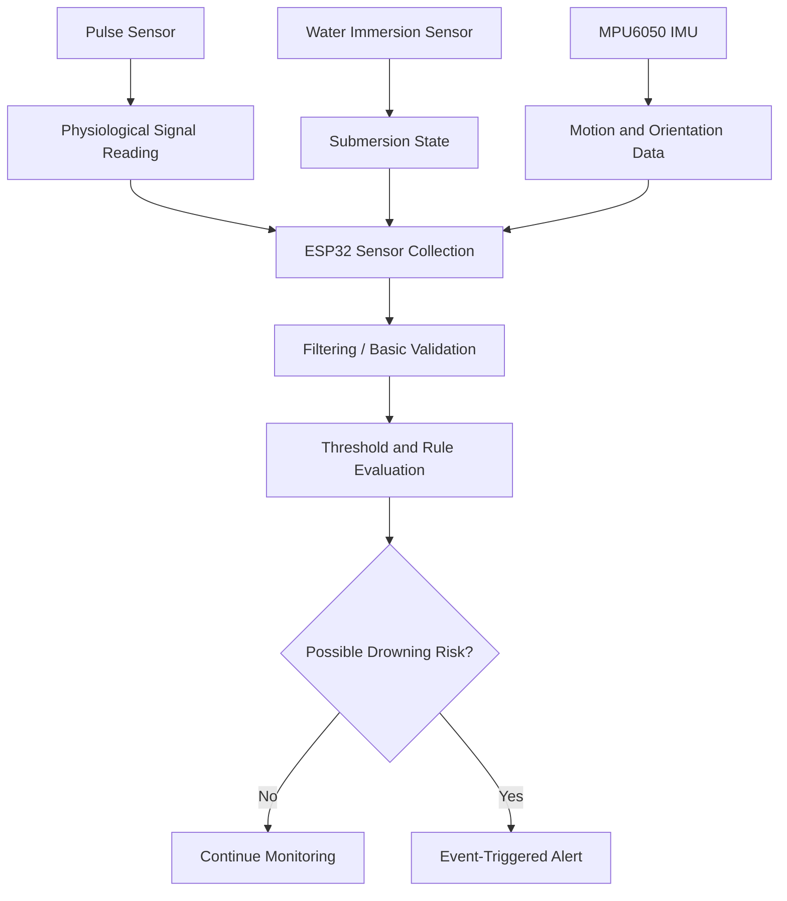

# Sensor Interaction Flow

Status: Implemented diagram.

This diagram shows how the current sensors contribute to the threshold-based detection logic.

Note: The interaction flow is rule-based and does not claim AI-based sensor fusion.
