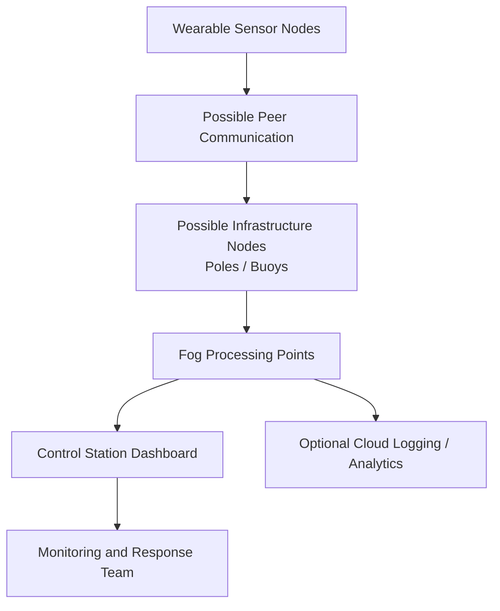

# Conceptual Shoreline Deployment

Status: Conceptual diagram.

This diagram shows a possible shoreline-scale deployment concept. It is not implemented in the current project.

A conceptual framework is shown for future research into larger aquatic environments. This diagram does not claim implemented infrastructure nodes, mesh routing, distributed storage, or shoreline deployment.
