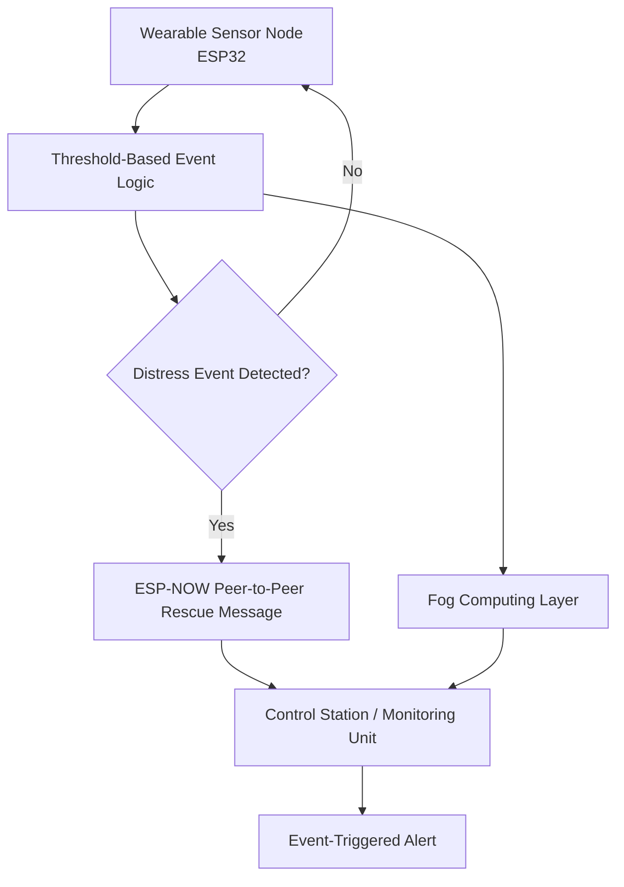
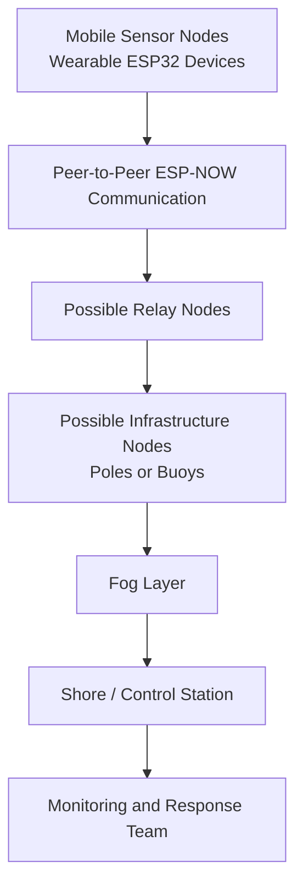
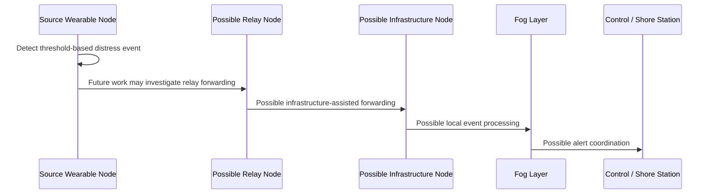

# Network Architecture

This document describes the communication architecture for the Drowning Detection and Rescue System. It separates the implemented system from conceptual architecture and future research directions to avoid overclaiming.

The current communication design uses ESP32 devices and ESP-NOW peer-to-peer rescue communication, with communication to a control station for event-triggered alerts. The broader infrastructure-assisted multi-hop architecture is a conceptual extension inspired by distributed and ad hoc networking principles. This project does not claim a VANET implementation.

## Current Implementation

Only the following communication and processing capabilities are presented as implemented:

| Implemented capability | Description |
| --- | --- |
| Multi-sensor drowning detection | The wearable system uses pulse, water immersion, and MPU6050 sensor inputs. |
| Threshold-based logic | Current decisions are based on rules and thresholds, not AI models. |
| ESP32 wearable node | ESP32 is used as the core controller and communication device. |
| ESP-NOW peer-to-peer rescue communication | ESP-NOW is used for peer-to-peer rescue message communication between ESP32 devices. |
| Communication with the control station | Alert information can be communicated toward a monitoring or control station. |
| Event-triggered alerts | Alerts are generated when rule-based distress conditions are met. |
| Fog computing | Local/fog processing is used for low-latency event evaluation. |

## Current Communication Flow

## Conceptual Architecture

A conceptual framework is shown below for a possible hybrid infrastructure-assisted multi-hop architecture. This is not presented as fully implemented in the current project.

## Conceptual Node Types

| Node type | Conceptual role | Current status |
| --- | --- | --- |
| Mobile sensor nodes | Wearable devices that sense risk indicators and generate distress events. | Current wearable sensing and ESP32 communication are implemented. |
| Relay nodes | Neighboring nodes that may forward messages when direct communication is limited. | Conceptual extension. |
| Infrastructure nodes | Fixed poles or buoys that may assist with forwarding, coordination, and coverage. | Future research direction. |
| Shore station | Central monitoring and response point for alert review. | Communication with a control station is part of the implemented direction; large-scale shore deployment is future work. |

## Rule-Based Topology Concept

The current project does not implement sophisticated routing algorithms, dynamic relay selection, coverage-aware communication, or formal fault-tolerance mechanisms.

One possible extension is rule-based topology management. Future work may investigate:

| Conceptual rule | Purpose |
| --- | --- |
| Maintaining nearby peer awareness | Improve local message-forwarding options. |
| Checking infrastructure availability | Determine whether a fixed node remains reachable. |
| Preferring stable communication paths | Improve reliability in larger aquatic areas. |
| Forwarding messages through available peers | Extend alert reachability when direct communication is limited. |

These are conceptual rules only. The current repository does not claim three-nearest-peer logic, a two-infrastructure-node requirement, or adaptive routing.

## Future Research Directions

Future work may investigate:

- Infrastructure nodes placed on poles, buoys, or shoreline structures.
- Distributed event metadata storage for temporary alert resilience.
- Dynamic relay selection.
- Coverage-aware communication.
- Connectivity boundary detection.
- Warning users when reliable communication coverage is lost.
- Fault-tolerance mechanisms for larger aquatic deployments.
- Large shoreline deployment with multiple fog or control-station points.

## Future Event Propagation Concept

The following diagram is a conceptual framework for future research, not a current implementation claim.

## Design Boundaries

- Current communication is limited to ESP32/ESP-NOW peer-to-peer rescue communication and communication with the control station.
- Infrastructure nodes, distributed storage, dynamic relay selection, boundary warnings, fault tolerance, and shoreline deployment are future or conceptual directions.
- The system is inspired by distributed and ad hoc networking principles, but it does not claim VANET implementation.
- No AI-based routing or machine learning communication optimizer is implemented.
