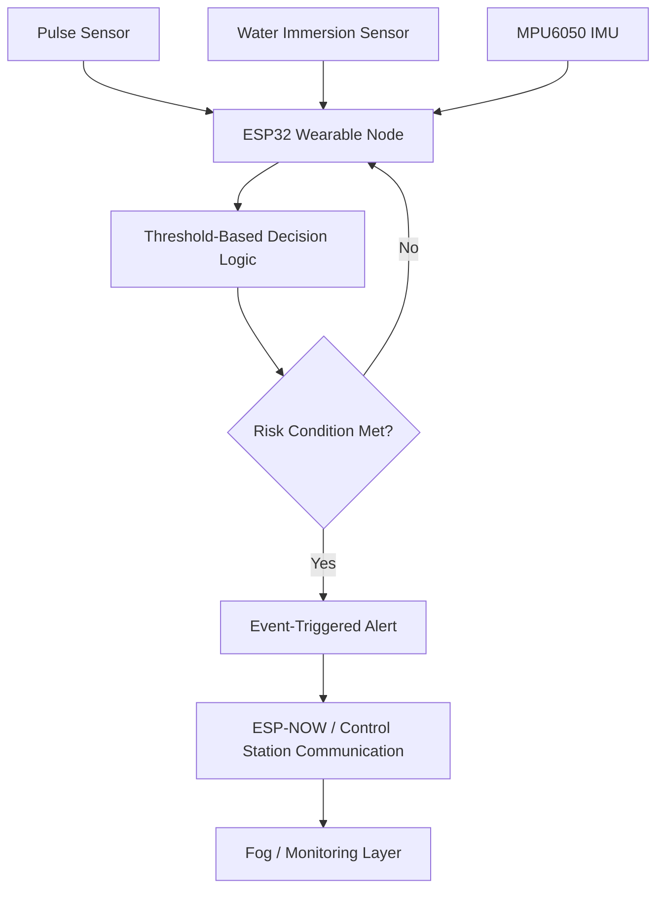

# Project Context

This document summarizes the public technical context of the Drowning Detection and Rescue System. It separates the implemented team project from future ideas and research directions.

## Implemented System

| Area | Status | Description |
| --- | --- | --- |
| Pulse sensor | Implemented | Used for physiological signal monitoring. |
| Water immersion sensor | Implemented | Used to detect submersion and support immersion-duration checks. |
| MPU6050 | Implemented | Used for motion, acceleration, and orientation monitoring. |
| ESP32 | Implemented | Used as the wearable node controller and communication device. |
| Threshold-based decision logic | Implemented | Current detection uses rule-based thresholds. |
| ESP-NOW peer-to-peer rescue communication | Implemented | ESP32 devices use ESP-NOW for peer-to-peer rescue communication. |
| Communication with control station | Implemented | Event information can be communicated to a monitoring/control station. |
| Event-triggered alerts | Implemented | Alerts are generated when rule-based risk conditions are satisfied. |
| Fog computing | Implemented | Local/fog processing is used for low-latency event evaluation. |
| Machine learning | Not implemented | AI models are future research directions only. |

## Implemented Data Flow

## Current Detection Approach

| Signal Type | Example Use | Current Method |
| --- | --- | --- |
| Physiological signal | Identify abnormal pulse trends. | Threshold-based evaluation. |
| Immersion state | Identify prolonged submersion. | Duration-based rule checks. |
| Motion and orientation | Identify inactivity or unusual movement. | Rule-based motion checks. |
| Communication event | Send rescue alerts. | ESP-NOW peer-to-peer communication and control-station communication. |
| Fog processing | Reduce response delay. | Local event evaluation. |

## Future Ideas

The following ideas are not described as current capabilities:

| Future idea | Description |
| --- | --- |
| Infrastructure-assisted networking | Future work may investigate fixed poles, buoys, or shoreline nodes. |
| Dynamic relay selection | Future work may investigate relay choices for larger coverage areas. |
| Coverage-aware communication | Possible extension for warning or routing decisions near communication boundaries. |
| Shoreline-scale deployment | Future research may study larger pool, beach, or lake deployments. |

## Research Directions

Future research may investigate:

- Structured sensor data collection.
- Synthetic data generation using Unity or Unreal Engine.
- Public activity recognition datasets for non-drowning motion comparison.
- Random Forest, XGBoost, SVM, LSTM, CNN, or YOLO as future experiments.
- Communication boundary detection and coverage-aware warning concepts.

These research directions are not implemented features and do not include claimed accuracy or validated performance metrics.

## Important Limitations

- No machine learning model has been implemented.
- No ML accuracy or performance metric is claimed.
- No real drowning dataset is included.
- Infrastructure nodes and shoreline deployment are future/conceptual extensions.
- The repository is not a certified life-saving system.
- Future validation would require controlled testing, safety review, and domain-specific evaluation.
