# Roadmap

This roadmap separates completed project work from future research directions. It prioritizes technical honesty and does not claim implemented AI models, achieved ML metrics, or large-scale deployment.

## Completed Scope

| Status | Milestone | Description |
| --- | --- | --- |
| Completed | Multi-sensor drowning detection | The system uses pulse sensor, water immersion sensor, and MPU6050 inputs. |
| Completed | Threshold-based logic | Current decision making uses rule-based and threshold-based checks. |
| Completed | ESP32 | ESP32 is used as the wearable controller and communication device. |
| Completed | ESP-NOW peer-to-peer communication | ESP-NOW supports peer-to-peer rescue communication between ESP32 devices. |
| Completed | Communication with the control station | Alert information can be communicated toward a monitoring or control station. |
| Completed | Fog computing | Local/fog processing is used for event evaluation and alert handling. |

## Future Work

| Status | Milestone | Description |
| --- | --- | --- |
| Future | Sensor data collection | Future work may collect structured sensor logs for analysis. |
| Future | Infrastructure nodes | Possible extension using fixed poles, buoys, or shoreline nodes. |
| Future | Coverage-aware communication | Future research may investigate coverage-aware message forwarding. |
| Future | Synthetic datasets | Synthetic data may be generated using Unity or Unreal Engine, alongside public activity recognition datasets. |
| Future | Random Forest, XGBoost, SVM | Future experiments may evaluate classical ML models for feature-based risk assessment. |
| Future | LSTM | Future research may explore time-series modeling for sensor windows. |
| Future | CNN and YOLO | Future research may explore camera-assisted detection where privacy and safety constraints allow. |
| Future | Large shoreline deployment | Future work may extend the architecture to larger aquatic areas. |

## Roadmap Overview

```mermaid
flowchart LR
    A["Completed: Multi-Sensor Detection"] --> B["Completed: Threshold Logic"]
    B --> C["Completed: ESP32 + ESP-NOW"]
    C --> D["Completed: Control Station Communication"]
    D --> E["Completed: Fog Computing"]
    E --> F["Future: Data Collection"]
    F --> G["Future: Communication Research"]
    G --> H["Future: ML Research"]
    H --> I["Future: Shoreline-Scale Study"]
```

## Technical Boundaries

- Infrastructure nodes are not marked as completed.
- Synthetic datasets are not marked as completed.
- Machine learning, LSTM, CNN, and YOLO are not marked as completed.
- Coverage-aware communication and shoreline deployment are not marked as completed.
- No implemented AI model, accuracy result, or validated performance metric is claimed.
