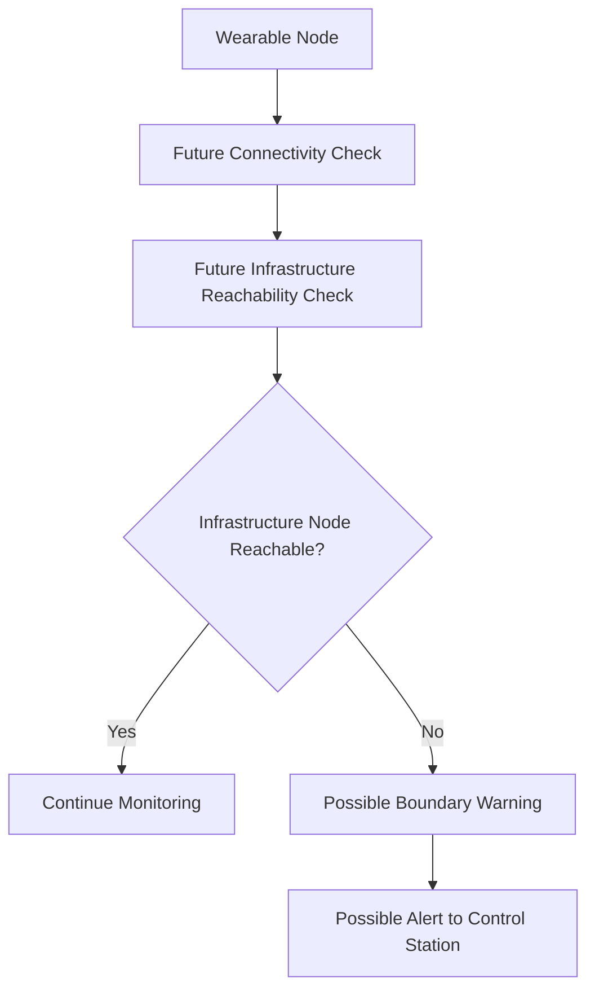
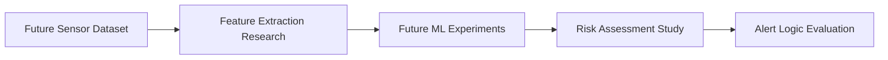
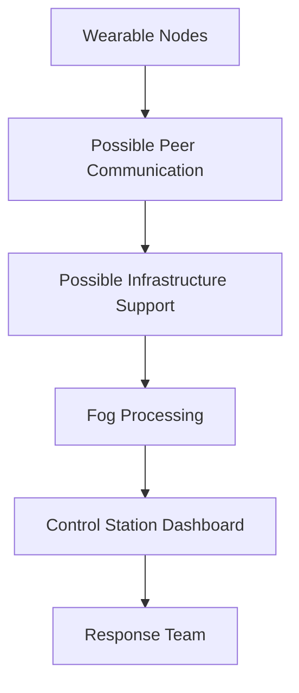

# Future Work

This folder documents possible future research directions beyond the current threshold-based prototype. Nothing in this folder should be read as implemented functionality.

Future work may investigate communication improvements, AI-assisted risk assessment, and larger deployment models while preserving the current emphasis on multi-sensor detection, ESP32 communication, fog computing, and event-triggered alerts.

## Future Communication Research

Possible extensions include:

| Future topic | Research purpose |
| --- | --- |
| Connectivity boundary detection | Study how a wearable node can detect when it is nearing the edge of reliable communication coverage. |
| Distance-based warning alerts | Explore warnings when distance from reliable communication support becomes risky. |
| Coverage-aware communication | Investigate message-forwarding strategies that account for coverage quality. |
| Infrastructure availability checks | Study whether fixed nodes remain reachable in a larger deployment. |
| Dynamic relay selection | Explore relay selection as a future routing concept. |
| Adaptive message forwarding | Investigate forwarding behavior that changes with local connectivity conditions. |
| Fault-tolerance mechanisms | Study resilience when nodes or links fail. |
| Large shoreline coverage | Explore communication support for pools, beaches, lakes, or waterfront zones. |

## Future Boundary-Warning Concept

Future work may investigate a mechanism that warns users approaching the communication boundary whenever no infrastructure node remains reachable. The goal would be to ensure that at least one infrastructure node is available for reliable message propagation in a future deployment.

A conceptual framework is shown below:

## Future AI Research

Machine learning is future work only. No machine learning model, achieved metric, or validated AI performance is claimed.

Possible models include:

| Model | Possible future investigation |
| --- | --- |
| Random Forest | Feature-based drowning-risk classification research. |
| XGBoost | Structured sensor-feature experiments. |
| SVM | Smaller feature-engineered dataset experiments. |
| LSTM | Time-series sensor-window research. |
| CNN | Camera-assisted or image-based research under appropriate privacy constraints. |
| YOLO | Future object or swimmer-state detection experiments in controlled settings. |

Synthetic data may be generated using Unity or Unreal Engine simulations. Public activity recognition datasets may also support non-drowning motion comparison or pretraining because realistic drowning datasets are scarce and difficult to collect safely.

## Future Deployment Research

A proposed architecture for future large-scale deployment may include wearable nodes, possible infrastructure nodes, fog processing, and a control-station dashboard.

## Documentation Principles

- Treat all content in this folder as future work or conceptual research.
- Avoid describing future ideas as current capabilities.
- Avoid claiming implemented AI models or performance metrics.
- Avoid claiming sophisticated routing algorithms or distributed storage mechanisms.
- Keep proposals suitable for an open-source academic project.
